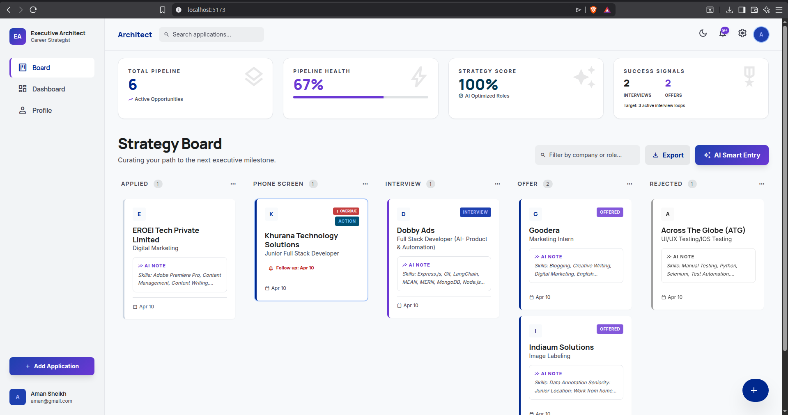

# 🚀 Nexus Talent: AI-Assisted Job Application Tracker

**Nexus Talent** is a state-of-the-art, premium job application management platform. Built for high-performance job seekers and executive architects, it leverages Artificial Intelligence to transform chaotic job hunts into structured, data-driven career strategies.



---

## ✨ Key Features

### 🧠 Architect AI Module
Parsing job descriptions is a thing of the past. Using advanced LLM orchestration via **Gemini/OpenRouter**, our AI will:
- **Extract Market Signals**: Automatically identify Company, Role, Seniority, and Location.
- **Skill Extraction**: Generate a clean list of required vs. nice-to-have technical skills.
- **Resume Optimization**: Generate 5 metric-driven, high-impact bullet points tailored specifically to that job description to help you beat the ATS.

### 📋 Strategy Board (Digital Kanban)
A fluid, drag-and-drop interface powered by `@dnd-kit` designed for executive-level oversight:
- **Interactive Funnel**: Move applications through stages from *Applied* to *Offer*.
- **Real-time Search & Filter**: Instant local search by company or role to manage large pipelines.
- **Follow-up Reminders**: Set specific follow-up dates and receive **pulsing "Overdue" alerts** on cards when strategic connections are missed.

### 📊 Executive Overview (Dashboard)
Gain deep insights into your career progression with a data-rich dashboard:
- **Pipeline Velocity**: Visual progress tracking across all application stages.
- **Recent Signals**: A live feed of the latest updates and activity in your job search.
- **AI Strategy Generator**: Real-time recommendations based on your pipeline density and converted offers.

### 👤 Executive Profile & Data Portability
- **Professional Identity**: Manage your professional bio and mission statement to contextualize AI suggestions.
- **CSV Export**: Industry-standard data portability—download your entire application history as a readable CSV at any time.

---

## 🛠️ Technical Stack

- **Frontend**: 
  - **Core**: React 19 + Vite + TypeScript
  - **Design**: Tailwind CSS 3 (Premium Glassmorphism & Custom Variable Design System)
  - **Motion**: Framer Motion (Bespoke micro-animations)
  - **State**: TanStack Query v5 (Server State) + Context API (Global Profile & Auth)
  - **UX**: Lucide React + Radix UI (Primitives)
- **Backend**: 
  - **Runtime**: Node.js + Express
  - **Intelligence**: Gemini Pro / LLM Orchestration via OpenRouter
  - **Database**: MongoDB (Mongoose ODM)
  - **Security**: JWT Authentication + Bcrypt Encryption

---

## 🚦 Getting Started

### Prerequisites
- Node.js 18+
- MongoDB (Local or Atlas)
- OpenRouter API Key (Free tier works perfectly)

### 1. Backend Setup
```bash
cd backend
npm install
cp .env.example .env
```
*Update `.env` with your `MONGODB_URI`, `JWT_SECRET`, and `OPENROUTER_API_KEY`.*

```bash
npm run dev
```

### 2. Frontend Setup
```bash
cd frontend
npm install
npm run dev
```
*The application should now be running at `http://localhost:5173`.*

---

## 📂 Project Structure

```text
├── backend
│   ├── src
│   │   ├── services/    # AI Orchestration, Prompt Engineering & Business Logic
│   │   ├── routes/      # Express Endpoint Handlers (Auth, Jobs, User Profile)
│   │   ├── models/      # MongoDB Schemas (Application, User)
│   │   └── middleware/  # Auth Guards & Security
├── frontend
│   ├── src
│   │   ├── components/  # Smart Components, Kanban Board, AI Modals
│   │   ├── pages/       # View Layouts (Dashboard, Board, Profile, Auth)
│   │   ├── lib/         # API (Axios) Configuration
│   │   └── contexts/    # Global State (Auth, Notifications, Theme)
```

---

## 📜 Architectural Decisions

- **Service-Oriented AI Layer**: AI logic is isolated from HTTP routes, supporting cascading fallbacks across multiple LLM models if the primary provider is unavailable.
- **Persistent Global Notification System**: A custom-built notification engine that persists user activity across sessions in localStorage.
- **Atomic Components**: A focus on reusable, logic-less UI primitives paired with high-level orchestrator components (KanbanGrid, StatsOverview).
- **Executive Aesthetics**: A design language centered on low-latency interactions, glassmorphism, and a tailored HSL-based color system.

---

## 🤝 Contributing

1. Fork the Project
2. Create your Feature Branch (`git checkout -b feature/AmazingFeature`)
3. Commit your Changes (`git commit -m 'Add some AmazingFeature'`)
4. Push to the Branch (`git push origin feature/AmazingFeature`)
5. Open a Pull Request

---

**Developed with 💜 by [Aman Sheikh](https://github.com/amansheikh3110)**
